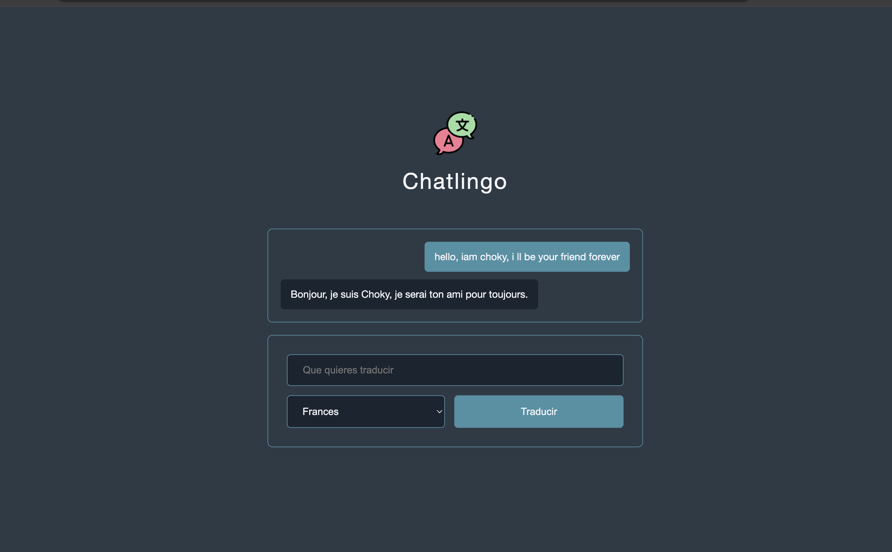

# Chatlingo

A simple, friendly web app for translating any phrase into another language.

---

---

## Live Demo

- [Try Chatlingo on Netlify](https://taupe-beignet-6b8275.netlify.app)

---

## Features

- Instantly translates your text using OpenAI's API
- Clean, distraction-free interface
- Choose from multiple target languages

---

## Tech Stack

- HTML
- CSS
- JavaScript

---

## How to Use

1. Go to the [live site](https://taupe-beignet-6b8275.netlify.app).
2. Enter your text in the input box.
3. Select the language you want to translate into.
4. Click **Traducir** to get your translation.

---

## Author

Alfonso Castro

---

## License

MIT
